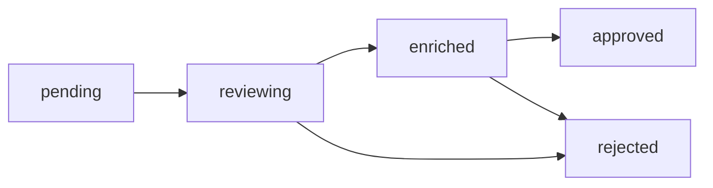

# Discovery Queue

Manage a queue of discovered creators for review, enrichment, and onboarding.

## Endpoints

### Add to Queue

```
POST /api/discovery/queue
```

### Get Queue Items

```
GET /api/discovery/queue
```

### Update Queue Item

```
PATCH /api/discovery/queue/{itemId}
```

### Remove from Queue

```
DELETE /api/discovery/queue/{itemId}
```

## Add to Queue

### Request

<ParamField body="profiles" type="array" required>
  Array of profile objects to add to the queue
  
  <Expandable title="Profile Object">
    <ParamField body="platform" type="string" required>
      Platform: `tiktok`, `instagram`, `youtube`, `twitter`
    </ParamField>
    
    <ParamField body="username" type="string" required>
      Platform username
    </ParamField>
    
    <ParamField body="platformUserId" type="string">
      Platform-specific user ID
    </ParamField>
    
    <ParamField body="discoverySource" type="string">
      How the profile was discovered: `keyword`, `trending`, `manual`
    </ParamField>
    
    <ParamField body="discoveryKeywords" type="string[]">
      Keywords that led to discovery
    </ParamField>
    
    <ParamField body="priority" type="string" default="medium">
      Queue priority: `low`, `medium`, `high`, `urgent`
    </ParamField>
  </Expandable>
</ParamField>

### Response

<ResponseField name="success" type="boolean">
  Indicates if profiles were added successfully
</ResponseField>

<ResponseField name="data" type="object">
  <Expandable title="Queue Response">
    <ResponseField name="added" type="number">
      Number of profiles added
    </ResponseField>
    
    <ResponseField name="duplicates" type="number">
      Number of duplicates skipped
    </ResponseField>
    
    <ResponseField name="items" type="array">
      Array of created queue items with IDs
    </ResponseField>
  </Expandable>
</ResponseField>

## Get Queue Items

### Request

<ParamField query="status" type="string">
  Filter by status: `pending`, `reviewing`, `enriched`, `approved`, `rejected`
</ParamField>

<ParamField query="platform" type="string">
  Filter by platform
</ParamField>

<ParamField query="priority" type="string">
  Filter by priority
</ParamField>

<ParamField query="limit" type="number" default="50">
  Maximum results (1-100)
</ParamField>

<ParamField query="offset" type="number" default="0">
  Pagination offset
</ParamField>

### Response

<ResponseField name="success" type="boolean">
  Indicates if the request was successful
</ResponseField>

<ResponseField name="data" type="object">
  <Expandable title="Queue List">
    <ResponseField name="items" type="array">
      Array of queue items
      
      <Expandable title="Queue Item">
        <ResponseField name="id" type="string">
          Queue item ID
        </ResponseField>
        
        <ResponseField name="platform" type="string">
          Platform
        </ResponseField>
        
        <ResponseField name="username" type="string">
          Username
        </ResponseField>
        
        <ResponseField name="status" type="string">
          Current status
        </ResponseField>
        
        <ResponseField name="priority" type="string">
          Priority level
        </ResponseField>
        
        <ResponseField name="discoverySource" type="string">
          Discovery source
        </ResponseField>
        
        <ResponseField name="discoveryKeywords" type="string[]">
          Keywords
        </ResponseField>
        
        <ResponseField name="enrichmentData" type="object">
          Enriched profile data (if enriched)
        </ResponseField>
        
        <ResponseField name="createdAt" type="string">
          ISO 8601 timestamp
        </ResponseField>
        
        <ResponseField name="updatedAt" type="string">
          ISO 8601 timestamp
        </ResponseField>
      </Expandable>
    </ResponseField>
    
    <ResponseField name="total" type="number">
      Total items matching filter
    </ResponseField>
    
    <ResponseField name="hasMore" type="boolean">
      Whether more items exist
    </ResponseField>
  </Expandable>
</ResponseField>

## Update Queue Item

### Request

<ParamField path="itemId" type="string" required>
  Queue item ID
</ParamField>

<ParamField body="status" type="string">
  New status
</ParamField>

<ParamField body="priority" type="string">
  New priority
</ParamField>

<ParamField body="notes" type="string">
  Reviewer notes
</ParamField>

<ParamField body="enrichmentData" type="object">
  Additional enrichment data
</ParamField>

## Examples

### Add Discovered Profiles to Queue

<Tabs>
  <Tab title="TypeScript">
    ```typescript
    // After keyword discovery
    const discoveryResults = await searchByKeywords(['fitness']);
    
    // Add high-engagement profiles to queue
    const highEngagement = discoveryResults.data.profiles.filter(
      p => (p.heartCount / p.followerCount) > 0.05
    );
    
    const queueItems = highEngagement.map(profile => ({
      platform: 'tiktok',
      username: profile.username,
      platformUserId: profile.id,
      discoverySource: 'keyword',
      discoveryKeywords: ['fitness'],
      priority: profile.verified ? 'high' : 'medium'
    }));
    
    const response = await fetch(
      'https://your-domain.com/api/discovery/queue',
      {
        method: 'POST',
        headers: {
          'Authorization': `Bearer ${apiKey}`,
          'Content-Type': 'application/json'
        },
        body: JSON.stringify({ profiles: queueItems })
      }
    );
    
    const { data } = await response.json();
    console.log(`Added ${data.added} profiles to queue, ${data.duplicates} duplicates skipped`);
    ```
  </Tab>
  
  <Tab title="JavaScript">
    ```javascript
    // Add single profile to queue
    async function addToQueue(profile) {
      const response = await fetch(
        'https://your-domain.com/api/discovery/queue',
        {
          method: 'POST',
          headers: {
            'Authorization': `Bearer ${process.env.API_KEY}`,
            'Content-Type': 'application/json'
          },
          body: JSON.stringify({
            profiles: [{
              platform: profile.platform,
              username: profile.username,
              platformUserId: profile.id,
              discoverySource: 'manual',
              priority: 'high'
            }]
          })
        }
      );
      
      return await response.json();
    }
    ```
  </Tab>
  
  <Tab title="cURL">
    ```bash
    curl -X POST https://your-domain.com/api/discovery/queue \
      -H "Authorization: Bearer YOUR_API_KEY" \
      -H "Content-Type: application/json" \
      -d '{
        "profiles": [
          {
            "platform": "tiktok",
            "username": "fitnesspro",
            "platformUserId": "7234567890",
            "discoverySource": "keyword",
            "discoveryKeywords": ["fitness"],
            "priority": "high"
          }
        ]
      }'
    ```
  </Tab>
</Tabs>

### Review Queue

```typescript
// Get pending items
const response = await fetch(
  'https://your-domain.com/api/discovery/queue?status=pending&priority=high',
  {
    headers: { 'Authorization': `Bearer ${apiKey}` }
  }
);

const { data } = await response.json();

// Process each item
for (const item of data.items) {
  // Enrich profile data
  const profile = await enrichProfile(item.platform, item.username);
  
  // Update queue item with enrichment
  await fetch(
    `https://your-domain.com/api/discovery/queue/${item.id}`,
    {
      method: 'PATCH',
      headers: {
        'Authorization': `Bearer ${apiKey}`,
        'Content-Type': 'application/json'
      },
      body: JSON.stringify({
        status: 'enriched',
        enrichmentData: profile
      })
    }
  );
}
```

### Approve and Create Profile

```typescript
// Get enriched items ready for approval
const enriched = await fetch(
  'https://your-domain.com/api/discovery/queue?status=enriched',
  {
    headers: { 'Authorization': `Bearer ${apiKey}` }
  }
).then(r => r.json());

for (const item of enriched.data.items) {
  // Create creator profile
  const creatorProfile = await prisma.creatorProfile.create({
    data: {
      name: item.enrichmentData.name,
      bio: item.enrichmentData.bio,
      category: inferCategory(item.discoveryKeywords),
      tags: item.discoveryKeywords,
      platformIdentifiers: {
        [`${item.platform}_username`]: item.username
      },
      // ... other fields from enrichmentData
    }
  });
  
  // Update queue status
  await fetch(
    `https://your-domain.com/api/discovery/queue/${item.id}`,
    {
      method: 'PATCH',
      headers: {
        'Authorization': `Bearer ${apiKey}`,
        'Content-Type': 'application/json'
      },
      body: JSON.stringify({
        status: 'approved',
        notes: `Created profile ${creatorProfile.id}`
      })
    }
  );
}
```

## Response Example

### Add to Queue Response

```json
{
  "success": true,
  "data": {
    "added": 5,
    "duplicates": 2,
    "items": [
      {
        "id": "queue_abc123",
        "platform": "tiktok",
        "username": "fitnesspro",
        "status": "pending",
        "priority": "high",
        "createdAt": "2026-03-06T12:00:00Z"
      }
    ]
  }
}
```

### Get Queue Response

```json
{
  "success": true,
  "data": {
    "items": [
      {
        "id": "queue_abc123",
        "platform": "tiktok",
        "username": "fitnesspro",
        "platformUserId": "7234567890",
        "status": "pending",
        "priority": "high",
        "discoverySource": "keyword",
        "discoveryKeywords": ["fitness", "workout"],
        "enrichmentData": null,
        "notes": null,
        "createdAt": "2026-03-06T12:00:00Z",
        "updatedAt": "2026-03-06T12:00:00Z"
      }
    ],
    "total": 15,
    "hasMore": true
  }
}
```

## Queue Status Flow



## Next Steps

<CardGroup cols={2}>
  <Card title="Budget Overview" icon="dollar" href="/api/budget/overview">
    Track discovery costs
  </Card>
  <Card title="Monitoring" icon="bell" href="/api/monitoring/alerts">
    Set up queue alerts
  </Card>
</CardGroup>
